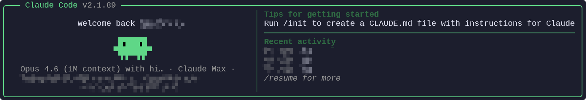

# Let's LLM

[English](README.md) | [中文](README_ZH.md) | [日本語](README_JP.md)

[](https://github.com/syntharea/llmgod/releases/latest)
[](https://github.com/syntharea/llmgod/releases/latest)
[](https://github.com/syntharea/llmgod/releases)
[](https://github.com/syntharea/llmgod/actions/workflows/compat-daily.yml)
[](https://github.com/syntharea/llmgod/actions/workflows/compat-daily.yml)

> God mode for [Claude Code](https://docs.anthropic.com/en/docs/claude-code).

**This is NOT a third-party Claude Code client.** Let's LLM is a runtime patch applied on top of the official Claude Code. It works with any version — as Claude Code updates, Let's LLM automatically re-extracts and re-patches against the new version on the next launch.

## Prerequisites

Install these **before** running the Let's LLM installer:

| Tool | Why | Install |
|------|-----|---------|
| **Claude Code** (native binary) | Let's LLM patches the official Bun standalone binary you already have | [`claude.ai/install.sh`](https://claude.ai/install.sh) (macOS/Linux) or [`claude.ai/install.ps1`](https://claude.ai/install.ps1) (Windows) |
| **ripgrep** | Required by Claude Code's Grep tool | `brew install ripgrep` / `apt install ripgrep` / `winget install BurntSushi.ripgrep.MSVC` |
| **Node.js >= 18** | Used by the patcher | [nodejs.org](https://nodejs.org) |
| **Bun** | Runtime for the patched cli.js; auto-installed if missing | [bun.sh](https://bun.sh), `npm install -g bun`, `scoop install bun`, or `choco install bun` |

## Install

**macOS / Linux:**
```bash
curl -fsSL https://github.com/syntharea/llmgod/releases/latest/download/install.sh | bash
```

**Windows (PowerShell):**
```powershell
irm https://github.com/syntharea/llmgod/releases/latest/download/install.ps1 | iex
```

Green logo = patched. Orange logo = original.



## What it does

### Feature Unlocks

| Patch | What you get |
|-------|-------------|
| **Internal User Mode** | 24+ hidden commands (`/share`, `/teleport`, `/issue`, `/bughunter`...), debug logging, API request dumps |
| **GrowthBook Overrides** | Override any feature flag via config file |
| **Agent Teams** | Multi-agent swarm collaboration, no flags needed |
| **Computer Use** | Screen control without Max/Pro subscription (macOS) |
| **Auto-mode** | Unlocks auto-mode for third-party API users (no firstParty gate) |
| **Ultraplan** | Multi-agent planning via Claude Code Remote |
| **Ultrareview** | Automated bug hunting via Claude Code Remote |
| **Limits Unchained** | Lift client-side ceilings via `provider.json.limits`: thinking-token budget, 1M context, agent concurrency, model allowlist |

### Restriction Removals

| Patch | What's removed |
|-------|---------------|
| **CYBER_RISK_INSTRUCTION** | Security testing refusal (pentesting, C2, exploits) |
| **URL Restriction** | "NEVER generate or guess URLs" instruction |
| **Cautious Actions** | Forced confirmation before destructive operations |
| **Login Notice** | "Not logged in" startup reminder |

### Visual

| Patch | Effect |
|-------|--------|
| **Green Theme** | Brand color → green. Patched at a glance |
| **Message Filters** | Shows content hidden from non-Anthropic users |

### Reliability

| Feature | What it does |
|---------|-------------|
| **1h Prompt Cache** | Forces 1h TTL allowlist on (was effectively 5m → much higher cache_creation token usage) |
| **Third-Party Cache Fix** | Auto-disables `x-anthropic-billing-header` when `baseURL` is non-Anthropic. The header's per-request `cch` field breaks prompt-cache hit rate on DeepSeek / OneAPI / Bedrock / vLLM and any other Anthropic-compatible proxy. You no longer need to set `CLAUDE_CODE_ATTRIBUTION_HEADER=0` yourself. |
| **Auto Re-patch** | Detects when the user's native Claude binary has been upgraded; transparently re-extracts and re-patches on next launch |

### Observability

| Feature | What it does |
|---------|-------------|
| **Cost & Cache X-ray** | Live statusLine HUD (context %, spend, cache-hit rate) plus a `llmgod xray` deep panel. A read-only usage probe taps each API response, so it doubles as proof that the prompt-cache fixes above are actually landing. |

## Commands

```bash
claude              # Patched Claude Code (replaces the official launcher)
llmgod             # Same as `claude`, explicit & guaranteed entry point
claude.orig         # Original unpatched version (auto-backed-up)
```

`llmgod` is unambiguous: on Windows where `claude.exe` may shadow `claude.cmd`, `llmgod.cmd` always works. Even after official self-update overwrites `claude`, `llmgod` keeps running the patched build.

## Configuration

`~/.llmgod/provider.json` is auto-created on first run. Setting `apiKey` lets you skip OAuth entirely and point Let's LLM at any Anthropic-compatible endpoint.

```json
{
  "apiKey": "sk-ant-...",
  "baseURL": "https://api.anthropic.com",
  "model": "",
  "smallModel": "",
  "timeoutMs": 3000000
}
```

- **`apiKey` set** → Let's LLM injects it as `ANTHROPIC_API_KEY` and isolates from `~/.claude/settings.json`. Works with Anthropic, DeepSeek, and OpenAI-compatible gateways. A non-Anthropic `baseURL` also populates `ANTHROPIC_AUTH_TOKEN` for gateway auth.
- **`apiKey` empty** → OAuth path. Run `claude auth login` once; `~/.claude` keeps hosting your subagents, skills, and MCP settings.

### OVERDRIVE keys (optional)

All keys below are optional — absent means current behavior is unchanged.

```json
{
  "limits": { "context1m": false, "thinkingBudget": 0, "concurrency": false, "modelAllowlist": false },
  "xray":   { "enabled": true, "statusLine": true },
  "pricing": { "claude-opus-4-8": { "input": 15, "output": 75, "cacheWrite1h": 30, "cacheRead": 1.5 } }
}
```

- **`limits.thinkingBudget`** (int) sets `MAX_THINKING_TOKENS`. **`limits.context1m`** appends `[1m]` to the Opus/Sonnet model env. Both take effect via env injection — no binary patch.
- **`limits.concurrency`** / **`limits.modelAllowlist`** require a regex patch against the native cli.js; their enforcement patches are confirmed per Claude version before going live.
- **`xray`** turns on the Cost & Cache HUD; `statusLine` auto-registers a status line only if you don't already have one (it never overwrites yours). **`pricing`** overrides the built-in price table per model — needed for third-party endpoints.

## How it works

Since `@anthropic-ai/claude-code` v2.1.113, the npm package no longer ships `cli.js` — it's a thin loader that dispatches to platform-specific Bun standalone binaries. Let's LLM adapts:

1. Locates the user's installed native Bun binary in `~/.local/share/claude/versions/`
2. Extracts the embedded `cli.js` source from the `__BUN` segment (Mach-O / ELF / PE)
3. Extracts the embedded `.node` native modules (audio-capture, image-processor, computer-use-*, url-handler) into `~/.llmgod/vendor/`
4. Rewrites `/$bunfs/...` virtual paths to point at the extracted modules
5. Applies 23 regex-based patches (version-agnostic — same patches work across many releases)
6. The `claude` / `llmgod` launchers run the patched cli.js under the Bun runtime

A `.source-version` stamp in `~/.llmgod/` records which native version was patched. On every launch the wrapper compares it against the latest binary in `versions/`; if the user upgraded Claude Code via the official installer, Let's LLM auto-re-patches on the next run.

## Update

**Just run `claude update` as usual.** Let's LLM patches the command to route through its own installer, which pulls the current Anthropic release from npm (`@anthropic-ai/claude-code-<plat>@latest`), re-extracts cli.js, re-applies patches, and rewrites the launcher. So the upstream update command keeps working the way you expect — you get the latest Claude, with patches still applied, in one step.

If you'd rather invoke the installer directly (same effect, both paths fetch the same upstream release and re-patch):

**macOS / Linux:**
```bash
curl -fsSL https://github.com/syntharea/llmgod/releases/latest/download/install.sh | bash
```

**Windows:**
```powershell
irm https://github.com/syntharea/llmgod/releases/latest/download/install.ps1 | iex
```

If you'd rather drop Let's LLM and use Anthropic's original `claude update` (which manages its own paths and would overwrite our launcher), uninstall first:

```bash
bash ~/.llmgod/install.sh --uninstall
```

## Uninstall

**macOS / Linux:**
```bash
curl -fsSL https://github.com/syntharea/llmgod/releases/latest/download/install.sh | bash -s -- --uninstall
hash -r  # refresh shell cache
```

**Windows:**
```powershell
irm https://github.com/syntharea/llmgod/releases/latest/download/install.ps1 -OutFile install.ps1; .\install.ps1 -Uninstall
```

Uninstall restores `claude.orig → claude` and removes the `llmgod` alias.

> After install or uninstall, restart your terminal or run `hash -r` if the command doesn't take effect immediately.

## License

GPL-3.0 — Not affiliated with Anthropic. Use at your own risk.

## Star History

[](https://www.star-history.com/?repos=syntharea%2Fllmgod&type=date&legend=top-left)
